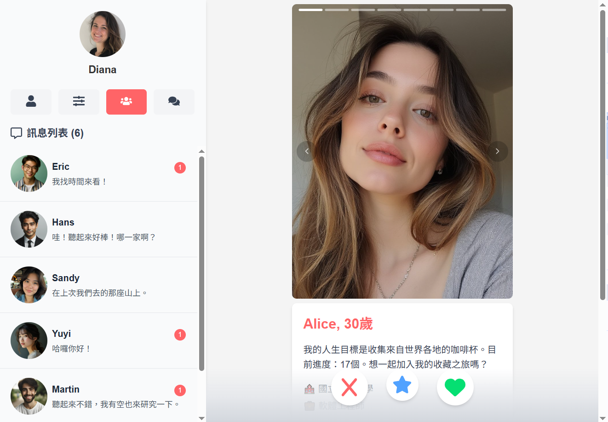

# 我們的交友平台

本專案為一個交友配對平台的前端介面示範，使用 React、Tailwind CSS 等現代前端技術建構，模擬「Tinder」風格的操作流程，包括用戶瀏覽、喜歡/跳過互動、聊天 UI、搜尋條件設定等。



⚠️ **本專案僅實作前端畫面，專注於 UI 設計與互動流程。**
- 使用假資料（mock data），無串接真實後端 API。
- 無登入認證或資料儲存功能，所有操作皆為視覺模擬。
- 畫面刷新或重新開啟時，狀態將不會保留。

---

## 🔧 技術棧

- React 19
- Vite
- Tailwind CSS
- React Router DOM v7
- Axios（用於模擬資料請求）
- React Swipeable（滑動手勢）
- React Icons
- ESLint

---

## 📁 專案架構簡介

```txt
src/
├── assets/                  # 圖片資源
├── components/              # 共用 UI 元件
│   ├── ChatBox.jsx          # 聊天視窗區塊
│   ├── FilterSettings.jsx   # 篩選偏好設定表單
│   ├── MatchCard.jsx        # 單一推薦用戶卡片
│   ├── MessageList.jsx      # 訊息列表顯示
│   ├── MobileNavbar.jsx     # 行動版底部導覽列
│   ├── RangeSlider.jsx      # 範圍選擇器元件
│   ├── RangeSlider.css      # 範圍選擇器樣式
│   └── Sidebar.jsx          # 桌面版側邊選單
├── context/                 # React Contexts，用於全域狀態管理
│   ├── AuthContext.jsx      # 管理登入狀態
│   ├── ChatContext.jsx      # 管理目前聊天對象與訊息
│   └── FilterContext.jsx    # 管理搜尋偏好設定
├── hooks/                   # 自定義 React Hooks
│   └── useIsMobile.jsx      # 判斷是否為行動裝置，回傳布林值
├── mocks/                   # 假資料
│   ├── chatMessages.json    # 模擬訊息對話內容
│   └── matches.json         # 模擬推薦用戶資料
├── pages/                   # 路由頁面組件
│   ├── FilterPage.jsx       # 篩選條件設定頁
│   ├── HomePage.jsx         # 首頁
│   ├── LoginPage.jsx        # 登入頁面（UI 模擬）
│   ├── MatchFeedPage.jsx    # 顯示推薦用戶並可滑動互動
│   ├── MessagesPage.jsx     # 聊天訊息頁面
│   └── ProfilePage.jsx      # 個人資料頁面
├── utils/                   # 工具函式
│   ├── ageUtils.js          # 處理年齡相關邏輯
│   ├── assetPaths.js        # 處理圖片路徑與引入
│   └── distanceUtils.js     # 計算地理距離相關邏輯
├── App.jsx                  # 主應用程式元件，設定路由與全域架構
└── main.jsx                 # 專案進入點，掛載 React App 至 DOM
```

---

## 🧭 網站功能一覽

### ✅ 已實作功能（前端 UI）
- 顯示用戶推薦列表（照片、姓名、年齡、自介）
- 「喜歡 ❤️」與「跳過 ❌」按鈕互動（模擬配對流程）
- 聊天界面設計（訊息列表與對話視窗）
- 搜尋偏好設定（年齡、性別、距離等條件範圍條）
- 使用者個人資料頁面
- 假登入邏輯（模擬登入/未登入狀態）
- 響應式設計（支援桌面與行動裝置）

### 🔒 尚未實作（需後端支援）
- 真實用戶登入（Facebook、SMS 驗證）
- 匹配演算法與雙向喜歡記錄
- 訊息發送與即時聊天
- 資料儲存與管理（偏好設定、聊天紀錄）

---

## 📌 備註

本專案中僅為 UI 設計作品展示，不包含商業用途。使用的所有圖片均來自以下免費的圖像資源平台：
- 人像照（頭像）：[UI Faces](https://uifaces.co/)
- 生活照（背景、情境照等）：[Unsplash](https://unsplash.com/)